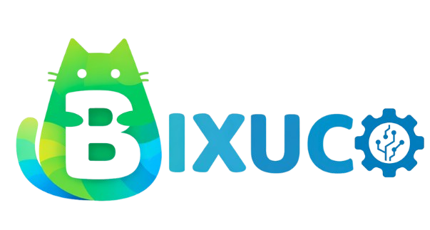
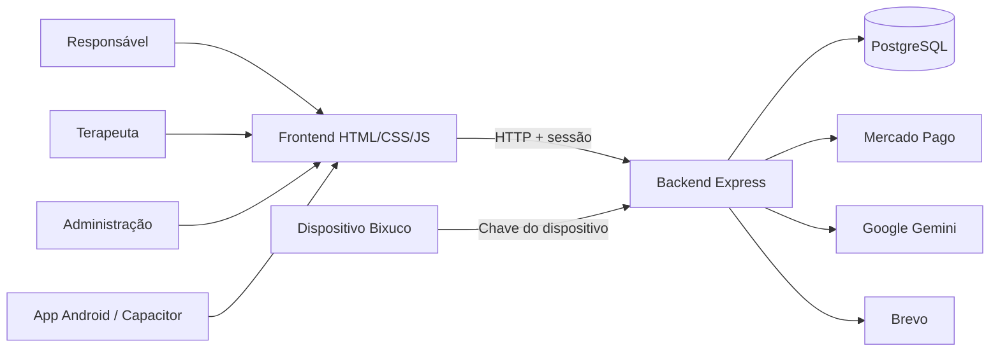
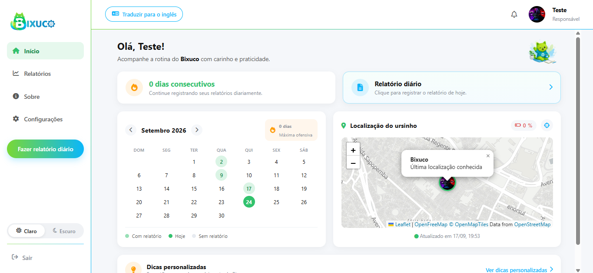
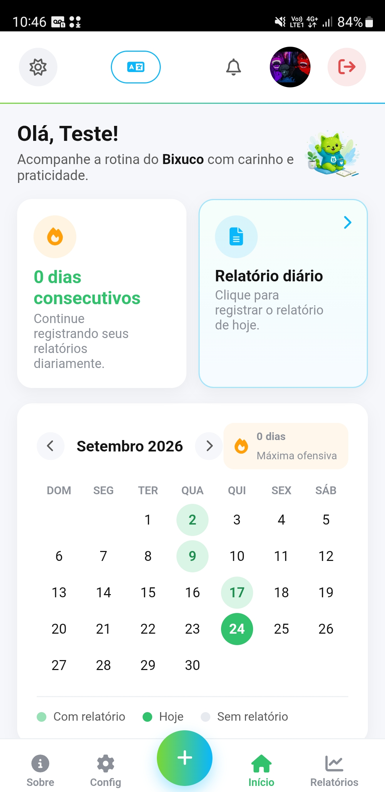

<p align="center">
  
</p>

# Bixuco

### Pelúcia inteligente + plataforma web/mobile para apoiar o acompanhamento sensorial de crianças

[](package.json)
[](package.json)
[](package.json)
[](package.json)
[](package.json)
[](android)

O **Bixuco** é um projeto acadêmico desenvolvido como TCC/PTI do curso técnico em Informática. A solução combina uma **pelúcia inteligente** com uma plataforma web/mobile voltada a responsáveis e terapeutas.

O sistema permite registrar informações da criança, acompanhar eventos captados pelo dispositivo, preencher relatórios diários, visualizar dados de localização e bateria, receber dicas personalizadas e compartilhar informações com o terapeuta vinculado.

> O Bixuco é uma ferramenta de apoio e acompanhamento. Ele não realiza diagnóstico médico ou psicológico e não substitui o acompanhamento de profissionais da saúde.

## Sumário

- [Sobre o projeto](#sobre-o-projeto)
- [Equipe](#equipe)
- [Perfis de usuário](#perfis-de-usuário)
- [Principais funcionalidades](#principais-funcionalidades)
- [Tecnologias](#tecnologias)
- [Arquitetura](#arquitetura)
- [Estrutura do repositório](#estrutura-do-repositório)
- [Instalação e execução local](#instalação-e-execução-local)
- [Variáveis de ambiente](#variáveis-de-ambiente)
- [Rotinas automáticas](#rotinas-automáticas)
- [Segurança](#segurança)
- [Capturas de tela](#capturas-de-tela)
- [Solução de problemas](#solução-de-problemas)
- [Uso acadêmico](#uso-acadêmico)

## Sobre o projeto

### O problema

O Transtorno do Processamento Sensorial (TPS) pode fazer com que determinados estímulos, como sons, texturas, cheiros, sabores ou contato físico, sejam percebidos de maneira muito intensa ou pouco intensa. Essas diferenças sensoriais podem afetar a rotina da criança e de seus responsáveis.

### A proposta do Bixuco

O Bixuco foi criado para auxiliar no acompanhamento desses momentos. A pelúcia inteligente funciona como parte do ecossistema do projeto e envia informações para a plataforma, permitindo que responsáveis acompanhem dados registrados pelo dispositivo e complementem essas informações por meio de relatórios diários.

Com autorização e vínculo entre as contas, o terapeuta também pode acompanhar informações do paciente e registrar notas relacionadas ao acompanhamento.

### Objetivo

Centralizar informações importantes da rotina da criança em um único ambiente, facilitando a comunicação entre responsáveis e terapeutas e tornando o acompanhamento mais organizado.

## Equipe

O projeto foi desenvolvido por:

| Integrante | Papel no projeto |
| --- | --- |
| Arthur Regiani Delgado Rosa De Oliveira | Desenvolvimento Front-end |
| Sophia Silva Freitas | Marketing e Financeiro |
| Yasmin Bertoni | Desenvolvimento Back-end |

## Perfis de usuário

| Perfil | Principais ações |
| --- | --- |
| Responsável | Cadastrar a criança, preencher o perfil sensorial e relatórios diários, acompanhar informações do dispositivo, receber dicas e gerenciar assinatura |
| Terapeuta | Receber e gerenciar vínculos, acompanhar pacientes, consultar relatórios e registrar notas |
| Administração | Gerenciar pedidos do dispositivo e publicar novidades |

## Principais funcionalidades

| Área | Funcionalidades |
| --- | --- |
| Cadastro e autenticação | Cadastro de responsável e terapeuta, login, Google OAuth, autenticação em duas etapas, recuperação de senha e exclusão de conta |
| Criança | Cadastro com foto e preenchimento de perfil sensorial |
| Relatório diário | Registro diário de informações sobre a rotina e os eventos da criança |
| Relatórios | Visualização de dados e gráficos para responsáveis e terapeutas |
| Vínculo com terapeuta | Solicitação, aceitação, cancelamento e remoção de vínculo entre responsável e terapeuta |
| Dispositivo Bixuco | Vinculação do dispositivo, registro de eventos, localização e nível de bateria |
| Dicas personalizadas | Geração de dicas com IA a partir das informações disponíveis no sistema |
| Assinaturas | Planos integrados ao Mercado Pago |
| Pedidos | Cadastro de endereço, confirmação e acompanhamento do pedido do dispositivo |
| Notificações | Central de notificações e lembrete de preenchimento do relatório diário |
| Mobile | Aplicação Android empacotada com Capacitor |

## Tecnologias

| Camada | Tecnologias |
| --- | --- |
| Front-end | HTML, CSS e JavaScript |
| Back-end | Node.js e Express 5 |
| Banco de dados | PostgreSQL com `pg` |
| Sessões | `express-session` e `connect-pg-simple` |
| Autenticação | Passport, Google OAuth 2.0 e bcrypt |
| Segurança | Helmet, CSP, reCAPTCHA v3 e rate limiting |
| Upload de imagens | Multer e `file-type` |
| Pagamentos | Mercado Pago |
| Inteligência artificial | Google Gemini |
| E-mails | Brevo |
| Agendamentos | `node-cron` |
| Mapas | Leaflet com OpenFreeMap/OpenStreetMap |
| Mobile | Capacitor e Android |
| Deploy | Render |
| Banco em produção | Neon PostgreSQL |

## Arquitetura


```mermaid
flowchart LR
    R[Responsável] --> F[Frontend HTML/CSS/JS]
    T[Terapeuta] --> F
    A[Administração] --> F
    F -->|HTTP + sessão| B[Backend Express]
    B --> DB[(PostgreSQL)]
    B --> MP[Mercado Pago]
    B --> G[Google Gemini]
    B --> E[Brevo]
    D[Dispositivo Bixuco] -->|Chave do dispositivo| B
    M[App Android / Capacitor] --> F
```

## Estrutura do repositório

```text
Bixuco/
├── .well-known/
│   └── assetlinks.json
├── android/                    # Projeto Android gerado pelo Capacitor
├── static/
│   ├── css/                    # Arquivos de estilo
│   ├── img/                    # Imagens do projeto
│   └── js/                     # Scripts das páginas
├── templates/                  # Páginas HTML
├── www/
│   └── index.html              # Entrada utilizada pelo Capacitor
├── capacitor.config.json
├── package.json
├── package-lock.json
└── server.js                   # Backend da aplicação
```

## Instalação e execução local

### Pré-requisitos

- Node.js
- npm
- Banco PostgreSQL
- Credenciais dos serviços externos utilizados pelo projeto para testar suas respectivas funcionalidades

### 1. Instale as dependências

```powershell
npm install
```

### 2. Configure as variáveis de ambiente

Crie um arquivo `.env` na raiz do projeto e preencha as variáveis necessárias.

O arquivo `.env` já está incluído no `.gitignore` e não deve ser enviado ao GitHub.

### 3. Inicie o servidor

Como o `server.js` atual não carrega o `dotenv` diretamente, execute localmente com:

```powershell
node -r dotenv/config server.js
```

Por padrão, a aplicação utiliza a porta definida em `PORT` ou a porta `3000` quando configurada dessa forma no ambiente.

### Aplicação Android

Para sincronizar e abrir o projeto Android:

```powershell
npx cap sync android
npx cap open android
```

## Variáveis de ambiente

```dotenv
PORT=3000
NODE_ENV=development
BASE_URL=http://localhost:3000
DATABASE_URL=
SESSION_SECRET=
GOOGLE_CLIENT_ID=
GOOGLE_CLIENT_SECRET=
RECAPTCHA_SECRET_KEY=
MP_ACCESS_TOKEN=
MP_PLAN_ID_MEDIO=
MP_PLAN_ID_COMPLETO=
GEMINI_API_KEY=
BREVO_API_KEY=
BREVO_FROM_EMAIL=
DEVICE_API_KEY=
```

| Variável | Finalidade |
| --- | --- |
| `PORT` | Porta utilizada pelo servidor |
| `NODE_ENV` | Ambiente de execução |
| `BASE_URL` | URL base da aplicação |
| `DATABASE_URL` | String de conexão com o PostgreSQL |
| `SESSION_SECRET` | Chave utilizada para proteger a sessão |
| `GOOGLE_CLIENT_ID` / `GOOGLE_CLIENT_SECRET` | Login com Google |
| `RECAPTCHA_SECRET_KEY` | Validação do reCAPTCHA v3 |
| `MP_ACCESS_TOKEN` | Integração com Mercado Pago |
| `MP_PLAN_ID_MEDIO` / `MP_PLAN_ID_COMPLETO` | IDs dos planos recorrentes |
| `GEMINI_API_KEY` | Integração com Google Gemini |
| `BREVO_API_KEY` / `BREVO_FROM_EMAIL` | Envio de e-mails pelo Brevo |
| `DEVICE_API_KEY` | Autenticação das requisições enviadas pelo dispositivo |

## Rotinas automáticas

As rotinas agendadas utilizam o fuso `America/Sao_Paulo`.

| Horário | Rotina |
| --- | --- |
| 19h | Verifica responsáveis que ainda não preencheram o relatório diário e envia lembrete quando permitido pelas preferências de notificação |
| 4h | Executa rotinas de limpeza de dados temporários do sistema |

## Segurança

O projeto possui diferentes mecanismos de proteção, incluindo:

- hash de senhas com bcrypt;
- sessões armazenadas no PostgreSQL;
- autenticação em duas etapas;
- reCAPTCHA v3 em rotas sensíveis;
- Helmet e Content Security Policy (CSP);
- limitação de tentativas em rotas sensíveis;
- consultas SQL parametrizadas;
- validação de arquivos enviados pelo usuário;
- proteção das rotas administrativas por autenticação e verificação de permissão.

## Capturas de tela

### Versão desktop

<p align="center">
  
</p>

### Versão mobile

<p align="center">
  
</p>

## Solução de problemas

| Problema | O que verificar |
| --- | --- |
| Erro de conexão com o banco | Confira a variável `DATABASE_URL` e a disponibilidade do PostgreSQL |
| Login com Google não funciona | Confira `GOOGLE_CLIENT_ID`, `GOOGLE_CLIENT_SECRET` e as URLs autorizadas no Google Cloud |
| reCAPTCHA falhando | Confira `RECAPTCHA_SECRET_KEY` e os domínios permitidos |
| Assinatura indisponível | Confira `MP_ACCESS_TOKEN`, `MP_PLAN_ID_MEDIO` e `MP_PLAN_ID_COMPLETO` |
| Dicas por IA não aparecem | Confira `GEMINI_API_KEY` |
| E-mails não chegam | Confira `BREVO_API_KEY` e `BREVO_FROM_EMAIL` |
| Dispositivo não envia dados | Confira `DEVICE_API_KEY` e se o dispositivo está corretamente vinculado |

## Uso acadêmico

O Bixuco foi desenvolvido para fins acadêmicos como projeto de TCC/PTI do curso técnico em Informática.

**Todos os direitos reservados aos autores do projeto.**
